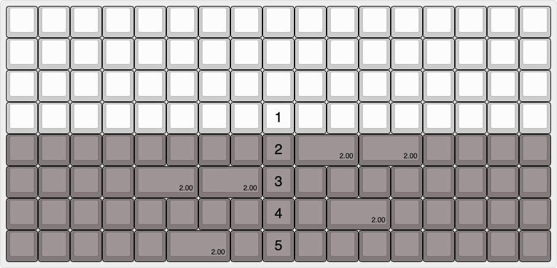

Using the standard and most awesome sites:

 - http://www.keyboard-layout-editor.com/
 - http://builder.swillkb.com/
 - https://wiki.ai03.com/books/pcb-design
 - http://www.masterzen.fr/2020/05/03/designing-a-keyboard-part-1/

 Available layouts that are supported:

 
